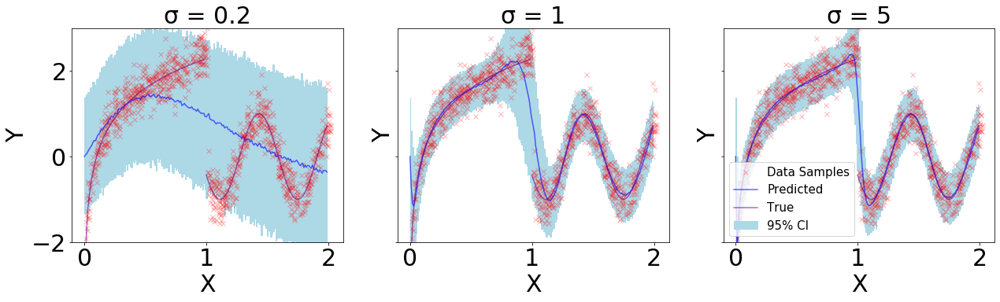
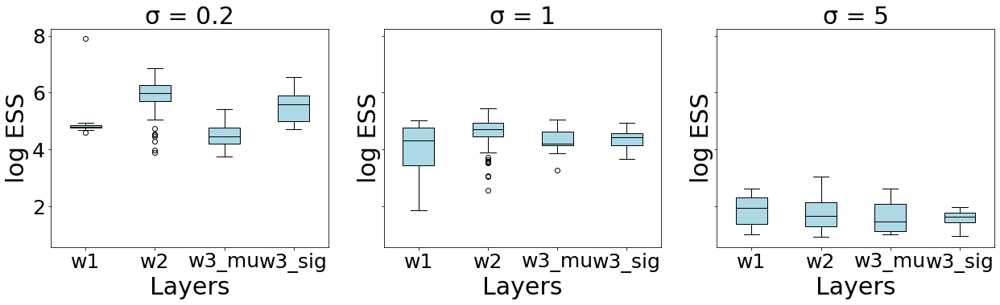
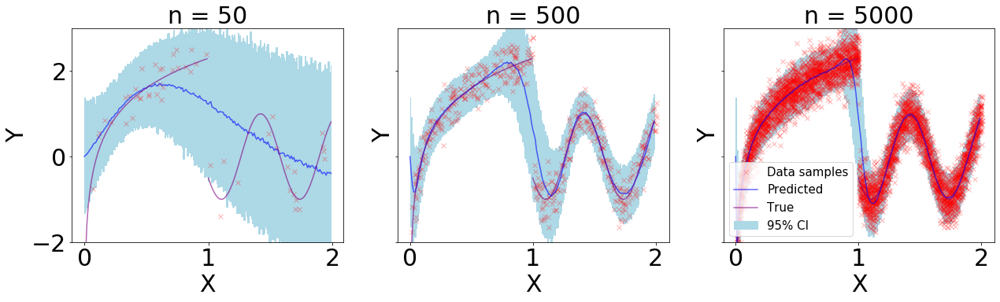
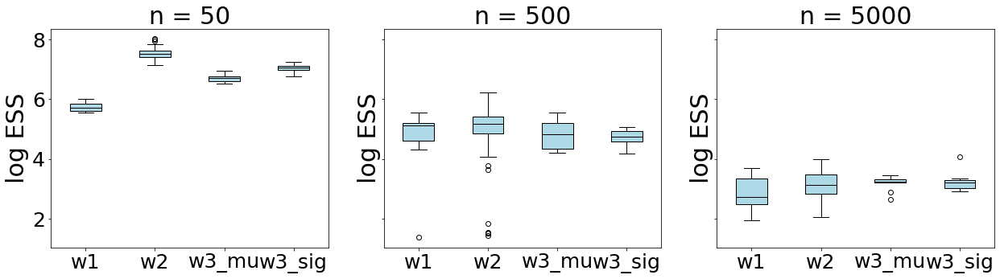

# Connection between Uncertainty Quantification and Gaussian Prior Parameters

Supplementary code for the paper on *Connection between Uncertainty Quantification and Gaussian Prior Parameters* submitted to *Bayesian Deep Learning workshop at NeurIPS'19*.

### Prerequisites
 - [Python3](https://www.python.org/download/releases/3.0/)
 - [virtualenv](https://packaging.python.org/guides/installing-using-pip-and-virtual-environments/)

### Instructions

 - Clone the repository.
 ```bash
git clone https://github.com/sharanry/UncertaintyQuantification
cd UncertaintyQuantification
 ```
 - Make new `virtualenv` environment and install dependencies from `requirements.txt`
 ```bash
python3 -m virtualenv env
source ./env/bin/activate
pip install -r requirements.txt
 ```
 - Run the two two scripts two reproduce results.
 ```bash
 python asymptotic_analysis.py
 python sigma_analysis.py
 ``` 
 - The plots generated will be available in `./results`.
 
### Results

#### Sigma Analysis Discontinuous regression using Bayesian Neural Networks

*Fig 1(a): 95\% confidence interval of the models trained over varying prior $\sigma$. Red crosses denote the data samples, blue dots represent the mean predictions and the blue fill expressed the 95\% CI.*


*Fig 1(b): Box plot of log of effective sample size of posterior samples of weights at each layer*

#### Asymptotic analysis of discontinuous regression using Bayesian Neural Networks

*Fig 2(a): 95
% confidence interval of the models trained over varying data sample sizes. Red crosses denote the data samples with prior σ = 1.0, blue dots represent the mean predictions and the blue fill expressed the 95% CI.*


*Fig 2(b): Box plot of log of effective sample size of posterior samples of weights at each layer*

